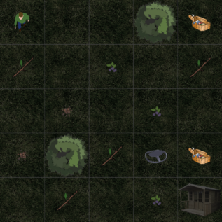
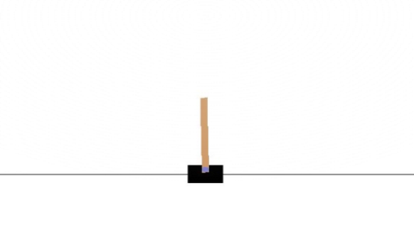
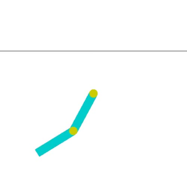

# reinforcement learning - defining and solving rl environments
this repository was created throughout cse564 (spring-21 w/ Alina Vereshchaka) and modified to be presentable.

## algorithms used
  - tabular methods - 
    - q-learning 
    - sarsa
    - dynamic programming (value iteration)
  - network-based methods - 
    - deep q-network
    - double deep q-network
  - actor-critic methods - 
    - q actor-critic

## environments used
  - forest environment (grid, custom defined)
  
    
    
  - openAI's cartpole-v1

    
    
  - openAI's acrobot-v1
    
    
