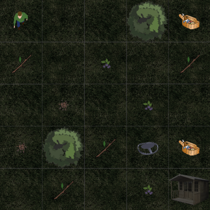

# reinforcement learning - defining and solving rl environments
this repository was created throughout CSE564 and modified to be presentable.
## environments used
  - forest environment (grid, custom defined)
  
    
  - openAI's cartpole-v1
  - openAI's acrobot-v1

